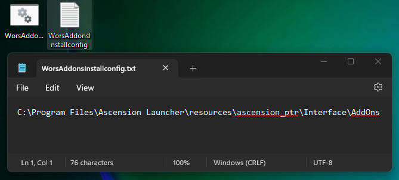

# Automatic Installer
- **I have added a simple script to download and add the addons from the github. The installer can also be used to update these addons to the newest versions. See more in Installer Guide**

# Addon Statuses

## Addons from Dagsvik and You
- **[XP Tracker](https://github.com/WorsAddons/WorsAddons/tree/main/XPTracker)**
- **[Level Lookup](https://github.com/WorsAddons/WorsAddons/tree/main/LevelLookup)**
- **[DropTable (some inaccuracy)](https://github.com/WorsAddons/WorsAddons/tree/main/DropTable)**
- **[UnequipItem](https://github.com/WorsAddons/WorsAddons/tree/main/UnequipItem)**
- **[VendorCloseFix](https://github.com/WorsAddons/WorsAddons/tree/main/VendorCloseFix)**

## Addons from Untitled
- **Coming Soon!**

## Other Addons
- **Contact Dagsvik on Discord if you have addons you want to add!**

# WorsAddons Automatic Installer Guide

Welcome to the WorsAddons Installer! This guide will help you set up the WorsAddons installer with a few simple simple steps.

---

## Prerequisites

- Ensure you have **administrator privileges** on your computer, as some steps will require it.
- Download the WorsAddonsInstall.bat executable. Can be downloaded from Github here:

**[Download WorsAddonsInstall.bat](./WorsAddonsInstall.bat)**

---

## Installation Steps

 ### Step 0: Save the bat file somewhere.
   This could be on your Desktop or anywhere you would like it. Remember running it will automatically update all the addons aswell in the future.

   

 ### Step 1: Find the Wors Addons Folder
   Locate the Wors Addons folder. It should include folders like `ascension_ptr`, `Interface`, `AddOns`, etc. seen in the image below.

   

 ### Step 2: Copy the Folder Path
   Select the folder path and copy the path to the addon folder. You’ll need this path to configure the installer.

   

 ### Step 3: Run the Installer as Administrator
   Right-click on `WorsAddonsInstall.bat` and select **Run as administrator**. This ensures the installer has the permissions needed to move files into your addon folder.

   

 ### Step 4: Paste the Path
   Once the installer prompts you, paste the path to the addon folder that you copied earlier. Then press Enter to continue.

   

 ### Step 5: Save the Path
   The installer will save the path for future use in a configuration file, so you don’t have to enter it each time.

   

 ### Step 6: Using the Saved Path
   The installer will use this saved path until you delete or modify the configuration file. Important to know if you make a mistake and don't get it working. When you got it working you won't have to think about it again.

   

 ### Step 7: Final Steps
   Once everything is set up, you should see a message similar to this image. Now you should be good to go, and can just run the Bat file to update to the newest versions on github.

   

---

## Troubleshooting

If you encounter issues:
- Ensure you have copied the correct path to the addon folder.
- Make sure to run the batch file as an administrator. It will ask you to do so if you forget. 
- If the installer doesn’t work, open the config text file and see if the path is correct. You can try deleting it and starting again.
-Don't hesitate to reach out if you are having issue, this should take less than a minute to do.

---

If you have any questions or suggestions, feel free to reach out.

And if you have your doubts about runninng the bat file, you can open it as a textfile and ask chatgpt what it thinks.
